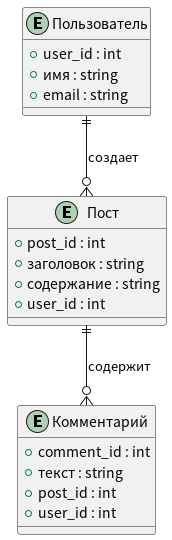

## Схема базы данных (ERD)
Схема базы данных, или диаграмма «сущность-связь» (ERD), представляет собой визуальное отображение структуры базы данных. Она показывает сущности, их атрибуты и связи между ними. Эта диаграмма помогает разработчикам и архитекторам баз данных понять, как данные организованы и как они взаимодействуют друг с другом.

**Основные элементы диаграммы:**
- Сущности: представляют собой объекты или концепции, которые имеют значение в контексте базы данных (например, Пользователь, Пост, Комментарий).
- Атрибуты: характеристики сущностей, которые хранят данные (например, имя, email, содержание).
- Связи: показывают, как сущности связаны друг с другом, включая типы отношений (один к одному, один ко многим, многие ко многим).

<details>
<summary>код puml</summary>

```
@startuml
entity "Пользователь" {
  +user_id : int
  +имя : string
  +email : string
}

entity "Пост" {
  +post_id : int
  +заголовок : string
  +содержание : string
  +user_id : int
}

entity "Комментарий" {
  +comment_id : int
  +текст : string
  +post_id : int
  +user_id : int
}

Пользователь ||--o{ Пост : создает
Пост ||--o{ Комментарий : содержит
@enduml
```
</details>


